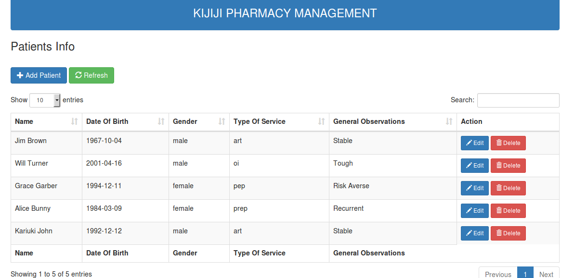
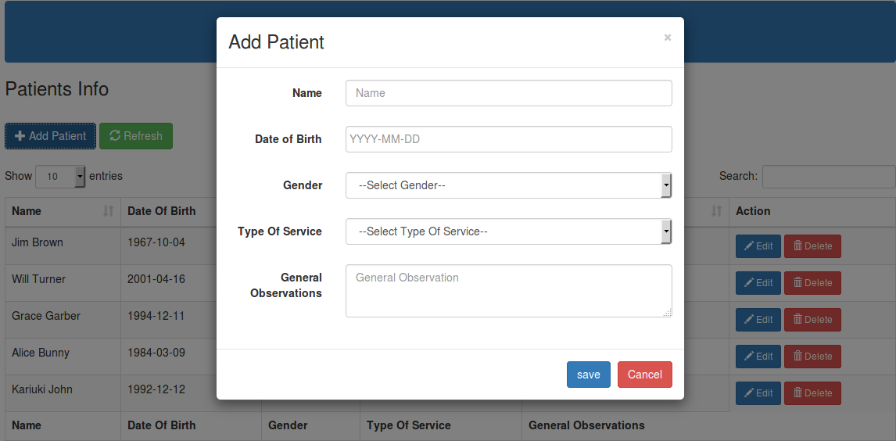

 
 
 
###################
What is CodeIgniter
###################

CodeIgniter is an Application Development Framework - a toolkit - for people
who build web sites using PHP. Its goal is to enable you to develop projects
much faster than you could if you were writing code from scratch, by providing
a rich set of libraries for commonly needed tasks, as well as a simple
interface and logical structure to access these libraries. CodeIgniter lets
you creatively focus on your project by minimizing the amount of code needed
for a given task.

*******************
Release Information
*******************

This repo contains in-development code for future releases.

*******************
Server Requirements
*******************

PHP version 5.6 or newer is recommended.

It should work on 5.3.7 as well, but we strongly advise you NOT to run
such old versions of PHP, because of potential security and performance
issues, as well as missing features.

************
Installation
************

INSTALLATION

    Setup a database and user.
    Go into PHPMYADMIN and import "kijiji_pharmacy.sql" into your newly created database by going to import>choose                  "kijiji_pharmacy.sql">choose import.
    Configure the database file by going to /application/config/database.php
    Configure your site specific values by going to /application/config/custom.php
    Your site should now be installed.

QUESTIONS/COMMENTS

    If you have any questions the fastest way to get results is by visiting my mail **kariukijoni@gmail.com**

*******
License
*******

Please see the `license
agreement <https://github.com/bcit-ci/CodeIgniter/blob/develop/user_guide_src/source/license.md>`_.

*********
Resources
*********

-  `User Guide <https://codeigniter.com/docs>`_
-  `Language File Translations <https://github.com/bcit-ci/codeigniter3-translations>`_
-  `Community Forums <http://forum.codeigniter.com/>`_
-  `Community Wiki <https://github.com/bcit-ci/CodeIgniter/wiki>`_
-  `Community Slack Channel <https://codeigniterchat.slack.com>`_

Report security issues to our `Security Panel <mailto:security@codeigniter.com>`_
or via our `page on HackerOne <https://hackerone.com/codeigniter>`_, thank you.

***************
Acknowledgement
***************

The CodeIgniter team would like to thank EllisLab, all the
contributors to the CodeIgniter project and you, the CodeIgniter user.
